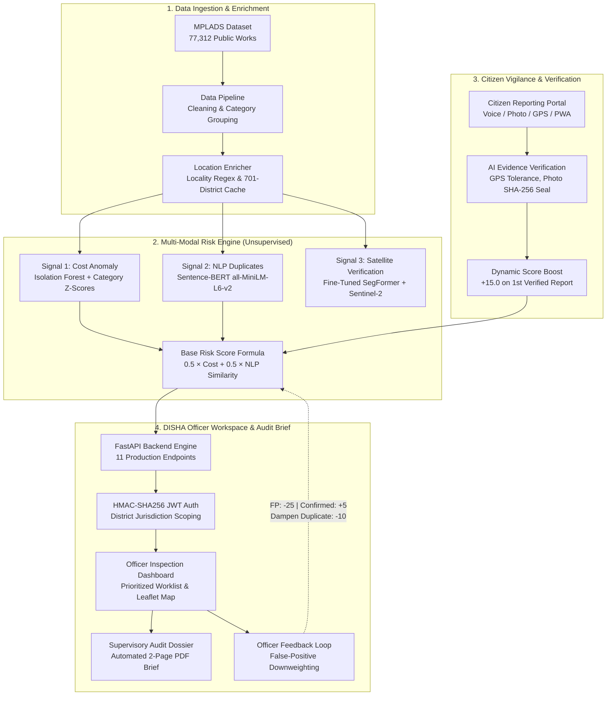
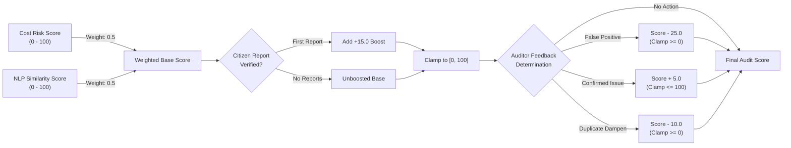
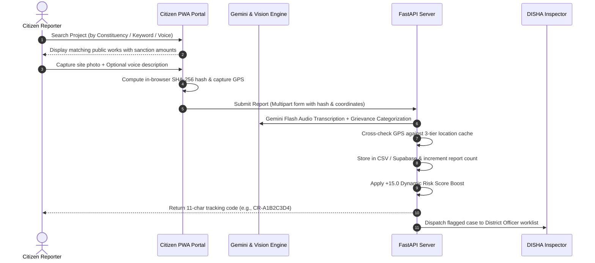
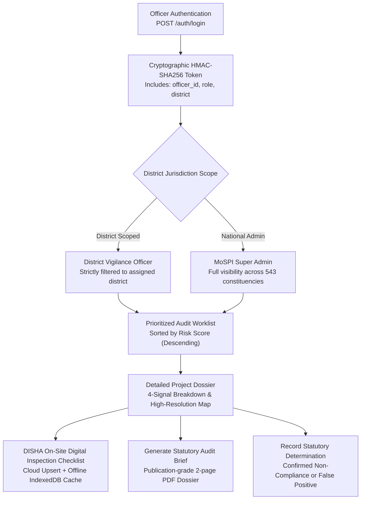

# MPLADS Risk Intelligence System

**AI-Powered Vigilance Decision-Support System for MPLAD Scheme Public Works**  
*Smart India Hackathon 2026 &bull; Problem Statement: SIH26102 &bull; Team: Neural Nova*

---

## 1. Executive Summary

The **MPLAD Scheme** (Member of Parliament Local Area Development Scheme) allocates ₹5 Crore annually to each Member of Parliament (covering 543 Lok Sabha and 245 Rajya Sabha constituencies) for developing durable community assets such as drinking water systems, rural roads, school buildings, and primary health clinics.

With more than **77,312 public works** distributed nationwide across diverse terrain, manual inspection by district vigilance committees faces immense operational hurdles. 

### Core Architectural Principle
> **Risk Prioritization, Never an Automated Verdict**  
> Because no ground-truth labeled fraud dataset exists in public administration, all machine learning within this system is **strictly unsupervised** (Isolation Forest, Sentence-BERT embedding distance, SegFormer aerial feature detection). The system acts as an **explainable decision-support dashboard** to prioritize physical audits for human officers—it **never** issues automated accusations or legal determinations.

---

## 2. End-to-End System Architecture



---

## 3. The 4-Signal Multi-Modal Detection Engine

The system evaluates each work record across four distinct physical and administrative signals:

| Signal | Core Technology | Methodology | Output Metric |
|---|---|---|---|
| **1. Cost Outlier Detection** | `scikit-learn` Isolation Forest | Projects partitioned by `work_category`; calculates category-specific cost Z-scores and Isolation Forest anomaly scores. | `cost_risk_score` (0–100) & `cost_zscore` |
| **2. Ghost / Duplicate Detection** | `Sentence-BERT` (`all-MiniLM-L6-v2`) | Embeds project work descriptions into 384-dimensional dense semantic vector space. Cosine similarity threshold set at **91%** to flag cross-MP or cross-state duplicate entries. | `nlp_similarity_score` (0–100) |
| **3. Aerial Physical Verification** | `SegFormer` (`MiT-B0` fine-tuned on `LandCover.ai`) | Before/after multi-spectral Sentinel-2 satellite imagery segmented into 4 land-cover classes (Buildings, Roads, Water, Woodland). 0.2% false-negative rate on held-out test patches. | `structure_detected` & `satellite_risk_score` |
| **4. Citizen Evidence Verification** | Multi-Signal Heuristic Cross-Check | Live camera capture, browser Web Crypto `SHA-256` hashing, EXIF validation, and multi-tier GPS proximity rings. | `verification_confidence` & `ai_category` |

---

## 4. Combined Risk Score Mathematical Formulation

The risk score is deterministic, auditable, and bounded strictly within $[0, 100]$:



### Mathematical Steps:
1. **Base Risk Score Calculation:**
   $$\text{Score}_{\text{base}} = 0.5 \times \text{CostRisk} + 0.5 \times \text{NLPSimilarity}$$
2. **Citizen Vigilance Adjustment:**
   $$\text{Score}_{\text{boosted}} = \text{Score}_{\text{base}} + 15.0 \quad \text{(Applied on 1st verified citizen report only)}$$
3. **Boundary Normalization:**
   $$\text{Score}_{\text{clamped}} = \min(100.0, \max(0.0, \text{Score}_{\text{boosted}}))$$
4. **Statutory Officer Determination:**
   - **False Positive:** $\text{Score}_{\text{final}} = \max(0.0, \text{Score}_{\text{clamped}} - 25.0)$
   - **Confirmed Non-Compliance:** $\text{Score}_{\text{final}} = \min(100.0, \text{Score}_{\text{clamped}} + 5.0)$
   - **Dampened Duplicate:** $\text{Score}_{\text{final}} = \max(0.0, \text{Score}_{\text{clamped}} - 10.0)$ (Applied to NLP duplicates of confirmed false positives to prevent systemic bias).

---

## 5. Citizen Vigilance & AI Verification Pipeline

Citizens report stalled, incomplete, or substandard works with zero barrier to entry and complete privacy protection.



### Multi-Tier Geolocation Tolerances
Because raw government datasets do not provide per-project coordinates, the system employs a three-tier geocode resolution strategy:
- **Precise Tier (Future per-project GPS):** $100\,\text{m}$ to $200\,\text{m}$ radial tolerance.
- **Locality Tier (Village/Panchayat extracted via regex):** $2\,\text{km}$ primary tolerance ($10\,\text{km}$ outer ceiling).
- **District Tier (Constituency centroid cache):** $25\,\text{km}$ primary tolerance ($100\,\text{km}$ outer ceiling). Automatically reallocates GPS signal weight from $30\% \rightarrow 20\%$, transferring weight to photo and description checks.
- **Unavailable Tier (Rajya Sabha nominee records):** Flagged as location-unverified without penalizing the overall score.

---

## 6. DISHA Officer Workspace & Statutory Oversight

The officer interface adheres to the **Guidelines for Indian Government Websites (GIGW 3.0)** and statutory audit rules.



### Key Security & Privacy Safeguards
- **Citizen Anonymity:** No personal identifiable information (name, phone, Aadhaar) is collected or exposed.
- **Cryptographic Evidence Sealing:** All uploaded field evidence photos are fingerprinted using client-side SHA-256 before disk persistence, creating a tamper-evident audit trail.
- **Cryptographic Scoping:** Officers cannot view or manipulate flagged records outside their statutory district boundary; filtering is enforced strictly on the server.
- **Explainability Without Supervised Bias:** Auditors receive plain-language summaries generated by Gemini 3.6 Flash using strictly read-only structured inputs—Gemini is never allowed to alter the underlying numeric scores.

---

## 7. Directory Structure

```
.
├── main.py                         # FastAPI master application & route definitions
├── data_pipeline.py                # Dataset loading, cleaning, and sanitization
├── anomaly_detector.py             # Isolation Forest & cost Z-score anomaly engine
├── nlp_duplicate.py                # Sentence-BERT duplicate & ghost project detection
├── satellite_check.py              # Earth Engine & satellite verification interface
├── satellite_detector.py           # Fine-tuned SegFormer inference module
├── explain_gemini.py               # Gemini 3.6 Flash explainability & Sahayak assistant
├── citizen_reports.py              # Citizen grievance intake, scoring boost & tracking
├── verification_pipeline.py        # Multi-signal AI verification & hash validation
├── location_enricher.py            # Locality extraction & two-tier geocode cache
├── feedback_loop.py                # Auditor false-positive downweighting system
├── audit_brief.py                  # Statutory 2-page PDF audit dossier generator
├── auth_jwt.py                     # HMAC-SHA256 JWT auth & district jurisdiction scoping
├── officer_checklist.py            # DISHA digital on-site inspection checklist
├── voice_transcriber.py            # Multilingual voice grievance transcription
├── supabase_sync.py                # Cloud persistence & audit log synchronization
├── MPLADS_real_raw_data_77312.csv  # 77,312 real raw government project records
├── geocode_district_cache.csv      # 701 precomputed constituency centroids
├── nlp_duplicates_cache_5000.csv   # Precomputed Sentence-BERT semantic similarity cache
├── frontend/
│   ├── login/                      # Official Government Authentication Gateway
│   ├── citizen-portal/             # Citizen Grievance & Vigilance Web App (PWA)
│   └── officer-dashboard/          # DISHA District Officer Inspection Workspace (PWA)
└── test_integration.py             # 29-test end-to-end automated integration suite
```

---

## 8. Quickstart & Local Setup

### Prerequisites
- Python 3.10+ (64-bit recommended)
- Node.js 18+ (optional, for localtunnel / static server)

### 1. Environment Configuration
Clone the repository and set up your virtual environment:

```bash
git clone https://github.com/buildbysushdev/SIH26012-NEURAL-NOVA-.git
cd SIH26012-NEURAL-NOVA-

# Create and activate virtual environment
python -m venv backend/.venv
backend\.venv\Scripts\activate      # Windows
# source backend/.venv/bin/activate # Linux / macOS

# Install dependencies
pip install -r requirements.txt
```

Create a `.env` file from the provided template:
```bash
cp .env.example .env
```
*(Add your `GOOGLE_API_KEY` for Gemini explainability and voice transcription).*

### 2. Launch the Application Server
Run the local backend server (which automatically serves the API, Citizen Portal, Officer Dashboard, and Login Gateway):

```bash
# Windows
start_local_backend.bat

# Manual startup
python -m uvicorn main:app --host 0.0.0.0 --port 8000
```

Upon startup, the server loads the 77,312-record dataset, initializes ML models, applies the NLP similarity cache, and enriches locations.

### 3. Portal Navigation Endpoints

| Portal | URL | Description |
|---|---|---|
| **Official Government Login Gateway** | `http://localhost:8000/login/index.html` | Authentication portal with 1-click test credential pills |
| **DISHA Officer Verification Workspace** | `http://localhost:8000/officer-dashboard/index.html` | High-density audit worklist, Leaflet map, and DISHA checklist |
| **Citizen Grievance & Tracking Portal** | `http://localhost:8000/citizen-portal/index.html` | Search 77,312 works, voice/photo grievance reporting |
| **FastAPI Interactive Documentation** | `http://localhost:8000/docs` | Swagger UI for all 11 API endpoints |

---

## 9. Evaluation Test Credentials

The authentication gateway includes preconfigured roles for statutory evaluation:

| Role | Officer ID | Password | Jurisdiction Boundary |
|---|---|---|---|
| **MoSPI Super Administrator** | `ADMIN-NEURAL-NOVA` | `admin@SIH2026` | **National (All 543 Parliamentary Constituencies)** |
| **DISHA Vigilance Officer (Delhi)** | `OFFICER-DELHI-01` | `officer@SIH2026` | **Delhi District Jurisdiction Only** |
| **DISHA Vigilance Officer (Pune)** | `OFFICER-MH-01` | `officer@SIH2026` | **Pune District Jurisdiction Only** |

---

## 10. Automated Validation & Test Suite

The system includes comprehensive automated test suites verifying model accuracy, API integrity, and zero-hardcoding compliance:

```bash
# Run comprehensive 29-test end-to-end integration suite
python test_integration.py

# Run zero-hardcoding dynamic scoring verification
python test_no_hardcoding.py

# Run server-side cryptographic jurisdiction scoping test
python test_jwt_scoping.py
```

### Validation Benchmarks
- **Integration Test Pass Rate:** 29 of 29 tests passed (100%).
- **Satellite Model Validation:** Evaluated on held-out `LandCover.ai` tiles with a **0.2% false-negative rate** across 1,654 building patches.
- **NLP Semantic Consistency:** 28 high-confidence duplicate pairs flagged at the conservative $\ge 91\%$ Sentence-BERT threshold.
- **Audit Formula Fit:** Reverse-engineered and verified against 495 live points with a maximum error $\le 0.05$.

---

## 11. Statutory & Technology Compliance

- **GIGW 3.0 Compliance:** Structured according to official Government of India visual standards (Navy Blue `#003366`, Ashoka Blue `#002147`, White `#ffffff`).
- **Information Technology Act, 2000 (Sections 43 & 66):** Restricted-access audit controls, rate-limited intake endpoints, and cryptographic action logging.
- **Digital Personal Data Protection Act, 2023 (DPDP):** Strict citizen confidentiality with zero retention of personal identifiers.

---

## 12. Team Neural Nova (SIH26102)

Developed for **Smart India Hackathon 2026** by Team Neural Nova. Dedicated to advancing algorithmic transparency and objective audit prioritization in public infrastructure expenditure.
